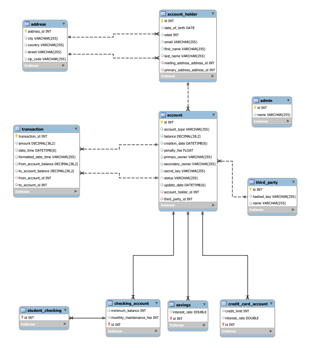

## Spring Boot

Proyecto Spring Boot con las dependencias / starters:
* MySQL database
* Spring Web
* Spring JPA
* Spring Dev Tools
* Spring security
* Lombok 

## Uso con POSTMAN

Puedes descargar el archivo de POSTMAN para este proyecto [aquí](BankSystemAPI.postman_collection.json).

## Diagrama de clases de la base de datos

Aquí se muestra el diagrama de clases de la base de datos:



## Uso 

Para utilizar esta aplicación, sigue los siguientes pasos:

1. Descarga el repositorio desde GitHub.
2. Abre el proyecto en tu IDE favorito.
3. Configura la conexión de base de datos en el archivo `application.properties`.
4. Ejecuta la aplicación.

Para crear una nueva cuenta de usuario, envía una solicitud POST al endpoint `/api/admin` con los siguientes parámetros:

* `adminName`: el nombre del administrador.
* el programa le asignará un nombre de usuario y contraseña.

Para crear un Usuario primero te tendrás que registrar como administrator, envía una solicitud GET al endpoint `/api/login.`

* Obtendrás un token para poder crear usuarios y cuentas asi como realizar transferencias y modificar informacion.

## Crear un AccountHolder

Para crear un nuevo AccountHolder, envía una solicitud PUT al endpoint `/api/admin/accountHolder` con los siguientes parámetros:

```json
{
    "name": "Nombre completo del usuario",
    "username": "Nombre de usuario",
    "email": "Dirección de correo electrónico",
    "password": "Contraseña del usuario",
    "dateOfBirth": "Fecha de nacimiento en formato YYYY-MM-DD",
    "street": "Nombre y número de la calle",
    "city": "Ciudad de residencia",
    "country": "País de residencia",
    "zipCode": "Código postal"
}
```
## Crear una cuenta de ahorros

Para crear una nueva cuenta de ahorros, envía una solicitud POST al endpoint `/api/admin/savings` con los siguientes parámetros:

```json
{
    "accountHolderId": "ID del AccountHolder",
    "secretKey": "Contraseña para la cuenta",
    "interestRate": "Tasa de interés de la cuenta",
    "minimumBalance": "Saldo mínimo requerido para la cuenta (opcional)"
}
```
## Crear una cuenta de crédito
Para crear una nueva cuenta de crédito, envía una solicitud POST al endpoint `/api/admin/credit` con los siguientes parámetros:
```json
{
  "accountHolderId": "ID del AccountHolder",
  "secretKey": "Contraseña para la cuenta",
  "creditLimit": "Límite de crédito de la cuenta",
  "interestRate": "Tasa de interés de la cuenta"
}
```

## Realizar operaciones bancarias
Una vez creada una cuenta, puedes realizar operaciones bancarias, como depositar o retirar dinero. Para hacerlo, envía una solicitud PATCH al endpoint `/api/admin/operations` con los siguientes parámetros:

`/api/admin/operations?accountId=1&type=deposit&amount=300`

o

`/api/admin/operations?accountId=1&type=withdraw&amount=300`

accountId (obligatorio): el ID de la cuenta en la que se realizará la operación.
* type (obligatorio): el tipo de operación que se realizará (deposit o withdraw).
* amount (obligatorio): el monto de la operación.

Recuerda que necesitas estar autenticado como administrador y tener un token válido para realizar estas operaciones.


## y mucho mas...